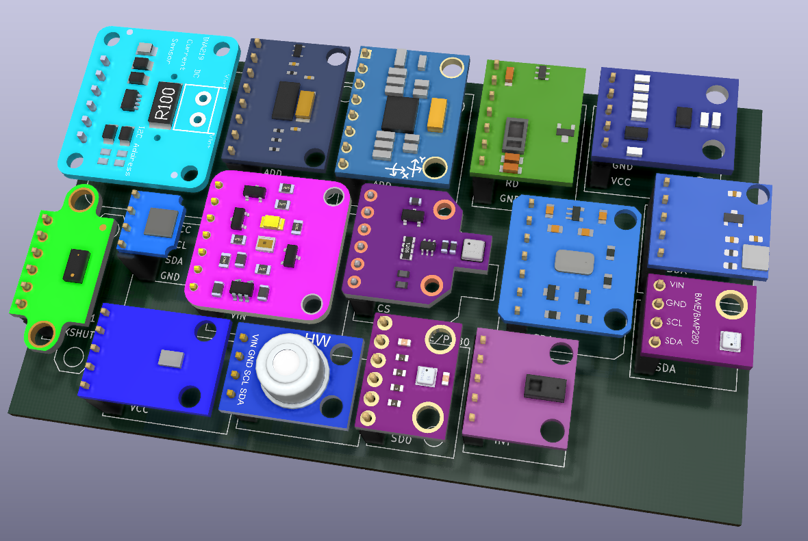
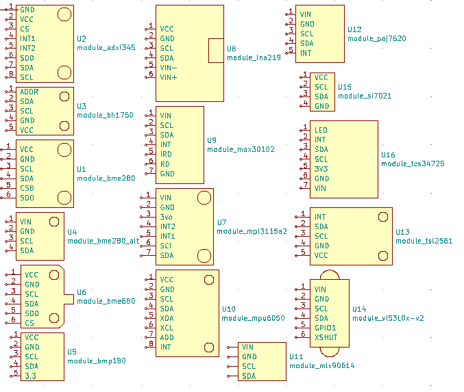
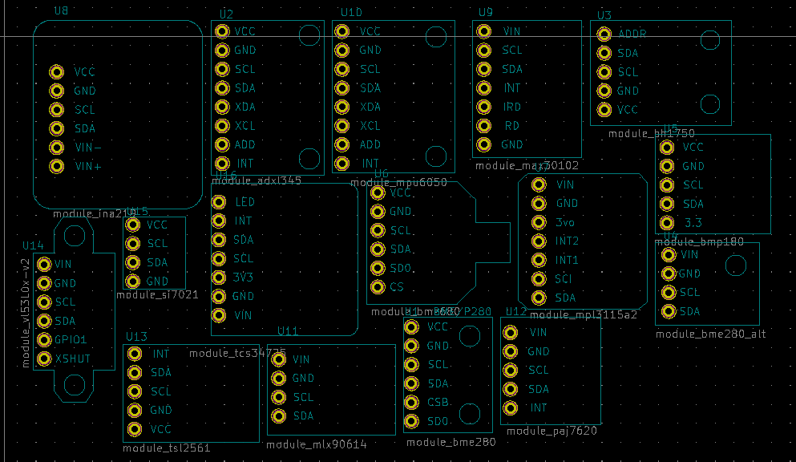

Usini Sensors Kicad Schematics
----------------------

This is my libraries of sensors breakout board for Kicad.
* All models are checked (but it is not guaranted to have no errors).
* All schematics/footprints are CC-0 public domain (some exception for 3D models)

Theses files included:
* **usini_sensors.pretty** folder with step (3D models) / kicad_mod (footprints files)
* **usini_sensors.dcm** (Schematics information)
* **usini_sensors.lib** (Schematics)

Just copy theses files in your kicad project, and add the links in the *preferences*

# Included modules
* ADXL345 Accelerometer
* INA219 Current sensor
* PAJ7620 Gesture sensor
* BH1750 Light Sensor
* BME280 Temperature / Humidity / Pressure sensor
* BME680 Temperature / Humidity / Pressure / Gas sensor
* MAX30102 Heart rate sensor
* SI7021 Temperature / Humidity Sensor
* MPL3115a2 Pressure Sensor
* TSL2561 Light sensor
* BMP180 Temperature / Pressure sensor
* MPU6050 Accelerometer sensor
* VL53L0X Distance sensor
* MLX90614 IR Temperature sensor

# How it was made
I recorded myself doing most of these.
* [Youtube Part 1](https://www.youtube.com/watch?v=2__ODQvKKTA)
* [Youtube Part 2](https://www.youtube.com/watch?v=Mm6G-MrL5dA)
* [Youtube Part 3](https://www.youtube.com/watch?v=6xK2-JJZ6IQ)

It tooks me around 8 hours to made it which would have cost 81,2€ on minimal wage, so feel free to donate at https://ko-fi.com/usini

# Schematics


# PCB (footprints)



# 3D models
All 3D models listed here, were downloaded from grabcad, and are licenced as stated on **6.User Submissions**
```
each user of the Site -are granted- a worldwide, non-exclusive, royalty-free, fully-paid, perpetual, irrevocable, non-sublicensable, non-assignable, and non-transferable license to use.
```

* MLX90614 by Kirill Avdeev         : https://grabcad.com/library/ir-thermo-sensor-hw-691-mlx90614-1
* BME680 by Alexei Kositsin         : https://grabcad.com/library/cjmcu-680-bme680-bosch-sensor-1
* TCS34725 by Alexy Kositsin        : https://grabcad.com/library/tcs34725-rgb-sensor-module-1
* BME280 by Bernard Hess            : https://grabcad.com/library/gy-bme280-6-pin-version-1
* BME280 Alt by Marcell Stoer       : https://grabcad.com/library/gy-bme280-1
* BH1750 by Jonathan Griggs         : https://grabcad.com/library/bh1750-sensor-board-1
* INA219 by Juan J. Calle Linares   : https://grabcad.com/library/ina219-2
* MPU6050 by Nicola Cugola          : https://grabcad.com/library/mpu6050-1
* VL53l0x by Davor Granić           : https://grabcad.com/library/vl53l0x-v2-tof-sensor-1

All 3D models listed here are licenced as CC-0 Public Domain
* TSL2561 by Rémi Sarrailh          : https://grabcad.com/library/tsl2561-breakout-board-1
* PAJ7620 by Rémi Sarrailh          : https://grabcad.com/library/paj7620-breakout-board-1
* MPL3115A2 by Rémi Sarrailh        : https://grabcad.com/library/mpl3115a2-breakout-board-1
* Si7021 by Rémi Sarrailh           : https://grabcad.com/library/si7021-breakout-board-1
* BMP180 by Rémi Sarrailh           : https://grabcad.com/library/bmp180-breakout-board-2
* Audio 3.5mm TRRS by Rémi Sarrailh : https://grabcad.com/library/audio-3-5mm-trrs-1
* ADLX345 by Rémi Sarrailh          : https://grabcad.com/library/adxl345-breakout-board-1
